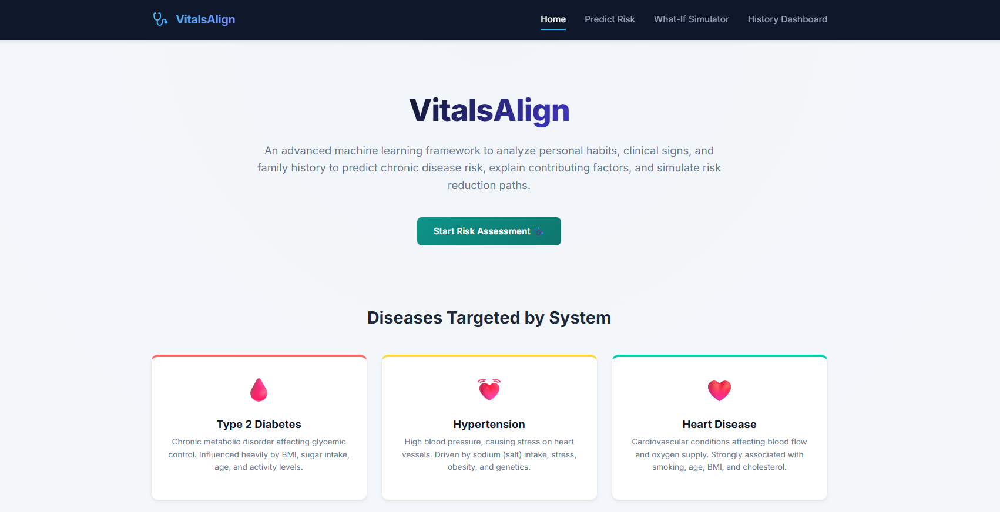
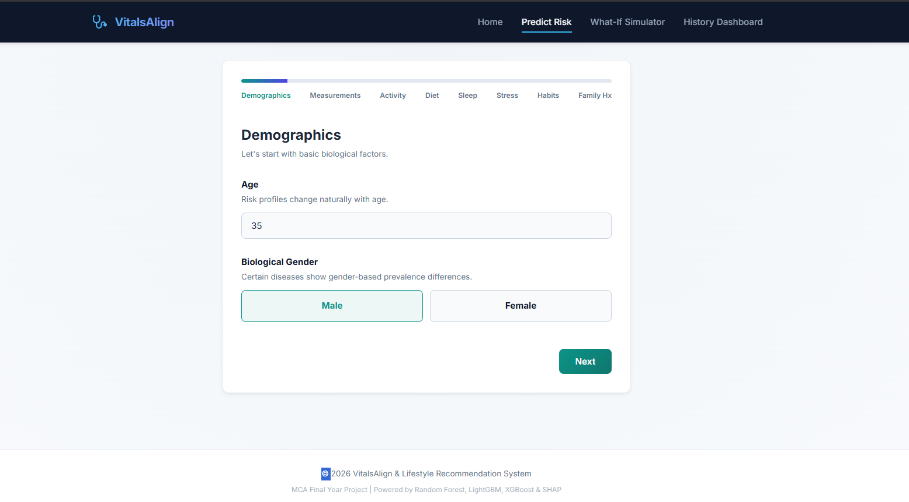
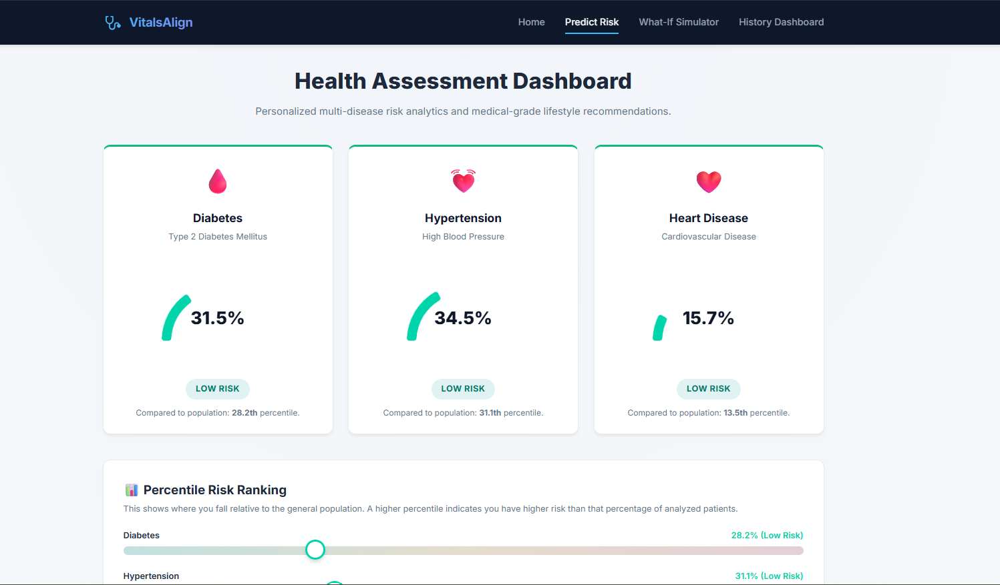
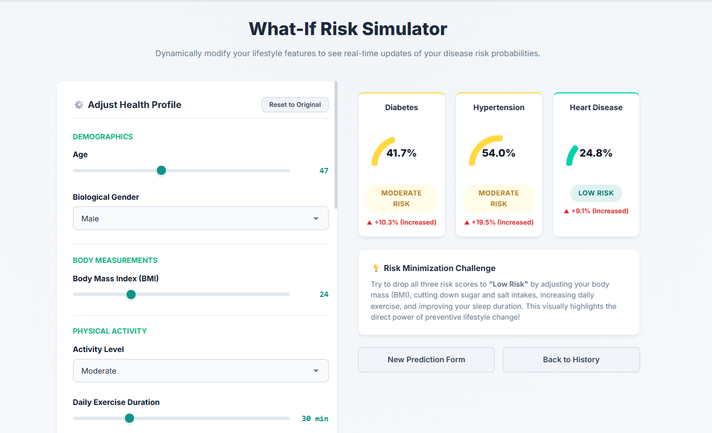

# VitalsAlign: Multi-Disease Risk Prediction & Lifestyle Recommendation System

VitalsAlign is a machine learning-powered health assessment platform designed to predict individual risk levels for **Diabetes, Hypertension, and Heart Disease** based on 16 demographic and lifestyle factors. By combining predictive modeling (XGBoost/Random Forest) with clinical interpretability (SHAP), the system provides personalized, actionable health insights.

---

## 🚀 Key Features

* **Multi-Step Risk Assessment**: An interactive 8-step questionnaire capturing demographics, biometrics (such as BMI), exercise, diet, sleep, habits, stress levels, and genetic predisposition.
* **Explainable AI (SHAP)**: Transcends "black box" models by providing clear, local feature contribution graphs showing exactly which habits drive your risk up (red) or down (green).
* **Live "What-If" Simulator**: Modify your lifestyle variables (e.g., lower salt intake, increase sleep, reduce BMI) using real-time sliders and instantly observe the drop in risk metrics.
* **Personalized Recommendations**: A rule-based engine that generates tailored lifestyle advice and medical guidance based on high-risk factors.
* **Exportable PDF Reports**: Download a clean, clinical-grade summary of your dashboard results and lifestyle recommendation plan.
* **Historical Dashboard**: Keep track of past risk assessments over time to monitor progress.

---

## 🛠️ Tech Stack

* **Backend**: Python, Flask (Web framework), SQLite (Data storage)
* **Machine Learning**: Scikit-Learn, XGBoost, LightGBM, SHAP (Explainable AI)
* **Frontend**: HTML5, CSS3 (Glassmorphism Dark Theme, Fluid Transitions), Javascript (AJAX Fetch API)
* **Visualization**: Chart.js (Interactive risk gauges)
* **Report Generation**: FPDF2

---

## 💻 Getting Started / How to Run

Follow these instructions to set up and run VitalsAlign locally on your machine.

### Prerequisites
Make sure you have **Python 3.10+** and **Git** installed on your system.

### 1. Clone the Repository
Open your terminal and clone this repository:
```bash
git clone https://github.com/Dipta9643/Multi-disease-prediction.git
cd Multi-disease-prediction
```

### 2. Set Up a Virtual Environment (Recommended)
Create and activate a virtual environment to manage dependencies:
```bash
# Windows (PowerShell/CMD)
python -m venv venv
venv\Scripts\activate

# macOS / Linux
python3 -m venv venv
source venv/bin/activate
```

### 3. Install Dependencies
Install the required packages:
```bash
pip install -r requirements.txt
```

### 4. Train the Models (Optional)
The project comes with pre-trained models. However, if you wish to retrain them using the synthetic dataset:
```bash
python ml/train_models.py
```

### 5. Launch the Application
Start the Flask development server:
```bash
python app.py
```

Once launched, open your web browser and navigate to:
👉 **[http://127.0.0.1:5000](http://127.0.0.1:5000)**

---

## 📸 Screenshots

Here are visual walkthroughs of the running system:

### 1. Home Page / Landing
*(Add your landing page screenshot here)*
```markdown

```

### 2. Multi-Step Risk Assessment Form
*(Add your questionnaire screenshot here)*
```markdown

```

### 3. Risk Assessment Dashboard (with SHAP and Recommendations)
*(Add your results dashboard screenshot here)*
```markdown

```

### 4. What-If Simulator
*(Add your simulator screenshot here)*
```markdown

```

---

## 📄 License
This project is open-source and available under the MIT License.
